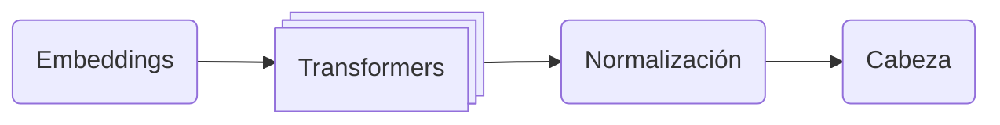

import Note from '../../components/Note.astro';
import Chart from '../../components/Chart.astro';
import LayeredInferenceTimeEstimator from '../../components/chiquito/LayeredInferenceTimeEstimator.astro';
import TokenizerEmulator from '../../components/chiquito/TokenizerEmulator.astro';
import CheckpointSplitter from '../../components/chiquito/CheckpointSplitter.astro';
import ForwardPassTimeline from '../../components/chiquito/ForwardPassTimeline.astro';
import AttentionMaskVisualizer from '../../components/chiquito/AttentionMaskVisualizer.astro';

Al tratar de estudiar cómo funciona un modelo grande de lenguaje por dentro, la primera frustración aparece en cuanto descubres que ni siquiera puedes cargarlo. En condiciones normales, un modelo de 32B parámetros<Note label="Aclaración sobre 32B"><strong>32B</strong> sigue la convención anglosajona, donde <em>billion</em> equivale a 10<sup>9</sup> que equivale a <strong>32&nbsp;mil millones</strong> de parámetros.<br/><br/>Eso es mil veces menos que 32 billones en el sentido español del término.</Note> en precisión completa ocupa decenas de gigas de VRAM, siendo inaccesibles para la mayor parte de GPUs domésticas.

<Chart
    title="Memoria (fp16) frente a parámetros del modelo"
    xLabel="Miles de millónes de parámetros"
    yLabel="Memoria (GB)"
    xScale="linear"
    yScale="linear"
    xTicks={[0, 5, 10, 15, 20, 25, 30, 35, 40, 45, 50, 55, 60, 65, 70]}
    data={[
        { x: 1,  y: 2 },
        { x: 7,  y: 14 },
        { x: 32, y: 65 },
        { x: 70, y: 140 },
    ]}
/>

En este artículo te hablo sobre **Chiquito**, un repositorio que he creado inspirado por AirLLM<Note label="AirLLM">[AirLLM](https://github.com/lyogavin/airllm) es un proyecto de [Gavin Li](https://github.com/lyogavin) que optimiza el uso de la memoria de inferencia, lo que permite que modelos de lenguaje de 70B se ejecuten en una sola tarjeta GPU de 4 GB sin cuantización, destilación ni poda.</Note>, que propone una técnica para poder cargar modelos bastante más grandes que la memoria VRAM disponible: cargarlos poco a poco.

## El sacrificio

Antes de entrar en detalles sobre cómo funciona esta técnica, hay que advertir que **este enfoque implica una pérdida clara: el rendimiento**. Cada vez que cargamos una capa en la memoria de nuestra GPU estamos realizando una operación que lleva tiempo.

> En mis pruebas use un equipo con 8GB de VRAM y generar 20 tokens llevó más de 30 minutos. Obviamente se puede usar esta técnica en producción. Cuando tiene sentido es cuando lo que quieres es examinar en local cómo funciona un modelo que no cabe en la memoria de tu tarjeta gráfica.

### Estimador de tiempo de inferencia

Resulta muy útil hacer unas estimaciones previas para tener una idea de cuánto tiempo lleva una inferencia con la técnica de carga de parámetros capa por capa.

<LayeredInferenceTimeEstimator />

## Cómo funciona

Una vez has entendido que esta técnica no pretende ser rápida sino resolver el problema de poder ejecutar, aunque sea despacio, modelos grandes en equipos con GPUs modestas, podemos empezar a hablar sobre cómo lo consigue.

### Los dispositivos `meta` de Pytorch

Para poder cargar un modelo capa a capa, necesitas saber qué "forma" tiene ese modelo:

- cuántas capas tiene,
- qué tipo de módulos contiene cada una,
- qué dimensiones tienen sus tensores.

Pero si intentas cargar el modelo de la forma habitual PyTorch reservará memoria para todos los pesos de golpe, que es exactamente lo que intentamos evitar. Aquí es donde entran los dispositivos meta de PyTorch.<Note label="Dispositivos meta de Pytorch">El dispositivo “[meta](https://docs.pytorch.org/docs/stable/meta.html)” es un dispositivo abstracto que denota un tensor que registra únicamente metadatos, pero ningún dato real.</Note>

**Un tensor en el dispositivo meta tiene forma y tipo de dato pero no ocupa ni un solo byte de memoria**. Es algo así como un tensor fantasma: sabe lo que mide pero no contiene nada.

```python
import torch

t = torch.empty(10000, 10000, device="meta")
print(t.shape) # torch.Size([10000, 10000])
print(t.device) # meta
```

> Este tensor ocuparía ~400 MB en float32.
>
> En el dispositivo meta ocupa 0 bytes.

Esto permite construir la arquitectura completa de un modelo —con todas sus capas, submódulos y dimensiones correctas— sin gastar memoria. La biblioteca `accelerate` de Hugging Face<Note label="Librería accelerate de HuggingFace">La librería [Accelerate](https://huggingface.co/docs/accelerate/index) de Hugging Face es una herramienta diseñada para simplificar el entrenamiento y la ejecución de modelos de aprendizaje automático en distintos entornos de hardware (CPU, GPU, múltiples GPUs o TPUs) sin necesidad de cambiar significativamente el código.</Note> ofrece un gestor de contexto que hace exactamente esto:

```python
from accelerate import init_empty_weights
from transformers import AutoModelForCausalLM, AutoConfig

config = AutoConfig.from_pretrained("Qwen/Qwen2.5-32B")
with init_empty_weights():
    model = AutoModelForCausalLM.from_config(config)
```

> **model** es un objeto completo: puedes recorrer sus capas,
> inspeccionar sus nombres y consultar las dimensiones de
> cada parámetro pero no ocupa ningún peso real en memoria.

**Chiquito** se apoya en este mecanismo en tres momentos:

- Al iniciar crea toda la estructura del modelo en meta para saber qué capas existen y cuánto pesa cada una.<Note label="Inicialización">Al [crear el modelo](https://github.com/elcapo/chiquito/blob/0.1.0/src/chiquito/model.py#L196-L208), se usa el gestor de contexto de la librería Accelerate que permite cargar el modelo en el dispositivo `meta`.</Note>
- Durante la inferencia carga los pesos reales de cada capa desde RAM a GPU justo antes de ejecutarla.<Note label="Inferencia">Justo antes de usar cada capa para [inferencia](https://github.com/elcapo/chiquito/blob/0.1.0/src/chiquito/model.py#L318-L328), se usa otro método de la librería Accelerate para mover los pesos al dispositivo GPU.</Note>
- Y por último, una vez procesada la capa, la devuelve al dispositivo meta, liberando la VRAM.<Note label="Liberación">Una vez se ha usado una capa para inferir y ya no es necesario mantenerla en memoria, se [mueve el tensor al dispositivo meta](https://github.com/elcapo/chiquito/blob/0.1.0/src/chiquito/model.py#L517-L518) liberando así la memoria.</Note>

## Carga desde HuggingFace

Chiquito usa HuggingFace para la carga de modelos. **En HuggingFace, todo modelo tiene un archivo JSON que describe su arquitectura** sin contener ningún peso. Puedes decargarlo con `AutoConfig`:

```python
from transformers import AutoConfig

config = AutoConfig.from_pretrained(
    "TinyLlama/TinyLlama-1.1B-Chat-v1.0"
)
```

| Objeto | Atributo | Valor |
| :--- | :--- | ---: |
| config | num_hidden_layers | 22 |
| config | hidden_size | 2048 |
| config | vocab_size | 32000 |
| config | architectures | ["LlamaForCausalLM"] |

Esta operación es ligera: descarga el correspondiente archivo `config.json` del modelo sin descargar sus pesos. Chiquito usa la configuración en dos momentos clave:

- Para contar las capas y construir la lista de nombres de cada una.<Note label="Conteo de capas">Cuando se [carga la configuración](https://github.com/elcapo/chiquito/blob/0.1.0/src/chiquito/model.py#L167-L189), se crea el modelo en el dispositivo `meta` y se recorre el árbol de módulos para contar cuántas capas tiene.</Note>
- Para detectar la arquitectura del modelo y saber qué clase instanciar.<Note label="Detección de la arquitectura">El campo `config.architectures[0]` se usa para [seleccionar automáticamente la clase](https://github.com/elcapo/chiquito/blob/0.1.0/src/chiquito/auto_model.py#L34) de modelo correcta.</Note>

### El tokenizador

Los modelos no trabajan con texto sino con secuencias de números enteros. **El tokenizador es el componente que convierte texto en identificadores numéricos** y viceversa.

<TokenizerEmulator defaultText="No tengas miedo a probar cosas nuevas" showEmbeddings={false} />

 Chiquito carga el tokenizador una sola vez durante la inicialización<Note label="Carga del tokenizador">Al iniciarse, Chiquito [carga el tokenizador]((https://github.com/elcapo/chiquito/blob/0.1.0/src/chiquito/model.py#L150-L152)) y lo deja accesible como `model.tokenizer`.</Note> y lo expone para que puedas codificar tus prompts y decodificar las salidas.

### Los archivos safetensors

En HuggingFace, **los pesos del modelo se almacenan en archivos safetensors**, un formato binario simple, rápido y que permite mapeo en memoria.<Note label="Safetensors">El formato [safetensors](https://huggingface.co/docs/safetensors/index) fue creado por Hugging Face como alternativa más segura y eficiente al formato pickle que usa PyTorch por defecto. Cada archivo es un mapeo plano de nombre de parámetro a tensor.</Note>

### El mapa de pesos

Un modelo pequeño puede caber en un único archivo pero los modelos grandes se fragmentan en varios archivos. Cuando un modelo está fragmentado, existe un archivo índice<Note label="Índice de Safetokens">Los modelos de HuggingFace fragmentados tienen un archivo llamado [model.safetensors.index.json](https://huggingface.co/deepseek-ai/DeepSeek-V2-Lite-Chat/blob/main/model.safetensors.index.json) que define una propiedad `weight_map` relacionando cada peso con el fichero Safetensors en el que está definido.</Note> que mapea cada parámetro al fragmento que lo contiene:

| Peso | Fichero |
| :---  | :--- |
| `model.embed_tokens.weight` | model-00001-of-00004.safetensors |
| `model.layers.0.self_attn.q_proj.weight` | model-00001-of-00004.safetensors |
| `model.layers.31.mlp.up_proj.weight` | model-00004-of-00004.safetensors |
| `lm_head.weight` | model-00004-of-00004.safetensors |

Este mapa de pesos es lo que hace posible la carga selectiva: podemos saber en qué fragmento están los parámetros de una capa concreta sin tener que cargarlo todo. Chiquito parsea este mapa para decidir qué archivos necesita abrir en cada momento.<Note label="Parseo del mapa de pesos">La primera vez que Chiquito [carga un modelo](https://github.com/elcapo/chiquito/blob/0.1.0/src/chiquito/splitter.py#L44-L53), usa este mapa para crear nuevos ficheros Safetensors organizados por capas. Si el modelo tiene un solo archivo de pesos, no se necesita mapa para dividirlo.</Note>

### Descarga desde el Hub

HuggingFace proporciona un método<Note label="Descarga desde HuggingFace">La API de HuggingFace implementa el método [`snapshot_download`](https://huggingface.co/docs/huggingface_hub/guides/download#download-an-entire-repository) que permite descargar un repositorio completo para una revisión dada.</Note> para descargar los archivos de un modelo a una caché local:

```python
import huggingface_hub

cache_path = huggingface_hub.snapshot_download(
    "TinyLlama/TinyLlama-1.1B-Chat-v1.0",
    token=None, # necesario si el modelo es privado
    ignore_patterns=["*.bin"], # ignorar pesos en formato antiguo
)
```

La primera vez que llamas al método los pesos del modelo se descargan a una caché local y el método devuelve la ruta en que fueron guardados. Las siguientes llamadas devuelven la misma ruta sin volver a descargar nada. Chiquito envuelve esta lógica en una función que primero comprueba si la ruta es un directorio local con archivos de modelo y, solo si no lo es, descarga desde el Hub.<Note label="Resolución de la ruta del modelo">Chiquito [intenta usar la ruta como directorio local](https://github.com/elcapo/chiquito/blob/0.1.0/src/chiquito/utils.py#L33-L45) antes de recurrir a `snapshot_download()`.</Note>

Con todo esto claro, ya tenemos el contexto necesario para entender cómo Chiquito orquesta la carga capa por capa durante la inferencia.

## La arquitectura transformer

Para cargar un modelo capa por capa no hace falta entender en profundidad sus matemáticas internas. Basta con tener claro que **un modelo causal de lenguaje es una tubería de cuatro bloques** por los que los datos fluyen en orden:



### Embeddings

El primero es el **embedding**, una tabla de búsqueda que convierte los identificadores enteros que produce el tokenizador en vectores densos. Si el vocabulario tiene 32.000 tokens y la dimensión oculta es 2.048, el embedding es una matriz de forma `(32000, 2048)`. Recibe un tensor `(batch, seq_len)` y devuelve un tensor `(batch, seq_len, hidden_dim)`.

<TokenizerEmulator defaultText="No tengas miedo a probar cosas nuevas" showEmbeddings={true} />

### Transformers

A continuación viene el núcleo del modelo: las **capas transformer**. Cada capa recibe un estado oculto y devuelve otro con la misma forma. Por dentro contienen el mecanismo de autoatención y una red prealimentada, pero para lo que nos ocupa aquí podemos tratarlas como cajas negras.

Lo relevante es que **son el bloque que se repite *N* veces y concentra la mayor parte de los parámetros del modelo**: un modelo de 1B como TinyLlama tiene 22 capas, uno de 32B puede tener 64. Este es el bloque que más tarda en cargarse y el que justifica toda la técnica.

### Normalización

Después de la última capa viene la **normalización final**, que estabiliza los estados ocultos antes de la proyección final sin cambiar sus dimensiones.

### Capa de salida

Y por último, una proyección lineal lleva los estados ocultos desde la dimensión oculta hasta el tamaño del vocabulario. Su salida es un vector de **logits** con una puntuación por cada token del vocabulario. El token con la puntuación más alta es, a grandes rasgos, la predicción del modelo para la siguiente posición.

## La convención de nombres

Los modelos de HuggingFace siguen un esquema de nombres consistente. Para los modelos tipo Llama —que incluyen Llama, Mistral, Qwen2 y muchos otros— los nombres son:

| Bloque | Ruta del módulo |
| :--- | :--- |
| Embedding | `model.embed_tokens` |
| Capa transformer i | `model.layers.i` |
| Normalización final | `model.norm` |
| LM head | `lm_head` |

Estos nombres son los que aparecen como prefijos en el mapa de pesos del modelo. Chiquito los guarda como una variable de clase<Note label="Nombres de bloques">Chiquito define los nombres como [una variable de clase](https://github.com/elcapo/chiquito/blob/0.1.0/src/chiquito/model.py#L99-L104) para poder adaptarlos fácilmente a arquitecturas que usan otra convención.</Note> para poder adaptarse a arquitecturas que usen otros nombres.

### Recorrer el árbol de módulos

Una vez creado el modelo sobre el dispositivo meta, podemos acceder a cualquier submódulo por su nombre recorriendo el árbol de atributos:

```python
module = model
for attr in "model.layers".split("."):
    module = getattr(module, attr)
```

Chiquito usa este mecanismo para construir, al arrancar, una lista ordenada con todos los bloques del modelo.<Note label="Construcción de la lista de capas">El método [`_build_layers()`](https://github.com/elcapo/chiquito/blob/0.1.0/src/chiquito/model.py#L260-L292) recorre el árbol del modelo para cada uno de los cuatro tipos de bloque y guarda referencias a los módulos junto con sus nombres.</Note> El resultado es una secuencia que el bucle de inferencia recorre de principio a fin, cargando los pesos de cada bloque justo antes de ejecutarlo y liberándolos después.

### Las Rotary Position Embeddings

Los transformers miran todos los tokens a la vez, sin un orden implícito. Eso significa que, sin ayuda, *"el gato se sentó en la alfombra"* y *"alfombra la en sentó se gato el"* les resultarían indistinguibles. Para evitarlo, **el modelo necesita saber en qué posición está cada token dentro de la frase**.

La mayoría de los modelos modernos resuelven esto con las Rotary Position Embeddings (RoPE),<Note label="Rotary Position Embeddings">RoPE codifica la posición aplicando pequeñas rotaciones a los vectores internos del modelo. Para lo que nos ocupa, basta con saber que es un ingrediente extra que las capas reciben junto a los tokens.</Note> una forma compacta de representar el número de posición de cada token para que las capas transformer puedan usarlo al procesarlos.

Lo relevante para Chiquito es algo mucho más práctico: estas posiciones se calculan una sola vez al principio de cada inferencia y se reutilizan en todas las capas. Además, el módulo que las calcula no es un parámetro entrenado del modelo sino una tabla derivada de la configuración, así que cabe siempre en memoria y no necesita cargarse y descargarse capa por capa como el resto de los pesos.<Note label="Cálculo de las RoPE">Chiquito [calcula las embeddings posicionales](https://github.com/elcapo/chiquito/blob/0.1.0/src/chiquito/model.py#L340-L346) una vez al principio de cada paso de inferencia y las reutiliza en todas las capas.</Note>

Con los cuatro bloques identificados, los nombres mapeados y las posiciones resueltas, Chiquito ya tiene todo lo que necesita para iterar el modelo de principio a fin cargando pesos bajo demanda.

## Partición por capas

Hasta aquí ya sabemos que HuggingFace guarda los pesos en uno o varios archivos safetensors y que el mapa de pesos nos dice dónde vive cada tensor. El problema es que **los pesos de una misma capa pueden estar repartidos entre varios fragmentos** y que cada fragmento, a su vez, mezcla pesos de capas distintas. Si para usar una capa tuviéramos que abrir el fragmento que la contiene y descartar todo lo demás, estaríamos leyendo cientos de megas sobrantes cada vez que pasáramos por esa capa.

Lo que Chiquito hace, la primera vez que trabaja con un modelo, es reorganizar sus pesos en un formato que le resulte cómodo: crea un directorio nuevo dentro del modelo, `chiquito_split/` y **escribe dentro un archivo Safetensors por cada bloque del transformer**.<Note label="Dónde ocurre la partición">La lógica de esta partición de modelos vive en [`splitter.py`](https://github.com/elcapo/chiquito/blob/0.1.0/src/chiquito/splitter.py).</Note> Así, durante la ejecución del modelo, cargar una capa concreta es abrir un único archivo con solo los pesos que esa capa necesita y ninguno de más.

> La partición es un coste que se paga una sola vez. La primera vez que Chiquito procesa un modelo nuevo lleva un rato, porque tiene que leer todos los fragmentos originales y escribir los nuevos por capas. Las siguientes veces detecta que ya está hecho y se salta el paso entero.

### Tener en memoria lo justo

El algoritmo es cuidadoso con la memoria. En lugar de cargar todos los fragmentos de golpe, va abriendo **solo los que la capa actual necesita**, acumula lo leído y borra los tensores de cada capa en cuanto acaba de escribirla en su archivo definitivo. Como las capas suelen estar en orden y los fragmentos originales contienen bloques contiguos, el proceso avanza de principio a fin sin llegar a tener nunca el modelo entero en RAM al mismo tiempo.

Cuando una capa vive a caballo entre dos fragmentos —cosa que pasa con frecuencia en los modelos reales—, el proceso tiene que mantener los dos cargados a la vez durante el rato en que escribe esa capa. Es inevitable: no se puede guardar una capa a medias.

### El marcador `.done`

Hay un detalle del proceso que tiene una motivación muy concreta. Después de escribir cada archivo Safetensors, Chiquito crea junto a él un segundo archivo vacío con el mismo nombre y la extensión `.done` añadida.

Escribir un archivo grande lleva tiempo y si el proceso se interrumpe en mitad de la escritura, lo que queda en disco es un archivo incompleto: existe, pero es inservible. **El marcador `.done` se crea justo después de que la escritura haya terminado sin problemas**, así que su mera presencia es la prueba de que el archivo de esa capa está íntegro.<Note label="Recuperación tras un corte">Si Chiquito se relanza después de una interrupción, [comprueba el directorio de partición](https://github.com/elcapo/chiquito/blob/0.1.0/src/chiquito/splitter.py#L17-L22) y solo vuelve a procesar las capas cuyo `.done` no aparece. Las demás se asumen correctas y no se tocan.</Note>

<CheckpointSplitter
    weightMap={{
        "model.embed_tokens.weight": "model-00001-of-00002.safetensors", 
        "model.layers.0.self_attn.q_proj.weight": "model-00001-of-00002.safetensors", 
        "model.layers.0.self_attn.k_proj.weight": "model-00001-of-00002.safetensors",
        "model.layers.0.self_attn.v_proj.weight": "model-00001-of-00002.safetensors", 
        "model.layers.0.self_attn.o_proj.weight": "model-00001-of-00002.safetensors",
        "model.layers.0.mlp.gate_proj.weight": "model-00001-of-00002.safetensors", 
        "model.layers.0.mlp.up_proj.weight": "model-00001-of-00002.safetensors",
        "model.layers.0.mlp.down_proj.weight": "model-00001-of-00002.safetensors", 
        "model.layers.0.input_layernorm.weight": "model-00001-of-00002.safetensors", 
        "model.layers.0.post_attention_layernorm.weight": "model-00001-of-00002.safetensors", 
        "model.layers.1.self_attn.q_proj.weight": "model-00001-of-00002.safetensors",
        "model.layers.1.self_attn.k_proj.weight": "model-00001-of-00002.safetensors", 
        "model.layers.1.self_attn.v_proj.weight": "model-00001-of-00002.safetensors", 
        "model.layers.1.self_attn.o_proj.weight": "model-00002-of-00002.safetensors", 
        "model.layers.1.mlp.gate_proj.weight": "model-00002-of-00002.safetensors", 
        "model.layers.1.mlp.up_proj.weight": "model-00002-of-00002.safetensors", 
        "model.layers.1.mlp.down_proj.weight": "model-00002-of-00002.safetensors", 
        "model.layers.1.input_layernorm.weight": "model-00002-of-00002.safetensors", 
        "model.layers.1.post_attention_layernorm.weight": "model-00002-of-00002.safetensors", 
        "model.norm.weight": "model-00002-of-00002.safetensors", 
        "lm_head.weight": "model-00002-of-00002.safetensors" 
    }}
    title="Partición por capas simulada sobre un modelo de 2 shards"
/>

## Inferencia por capas

Con el modelo ya repartido en archivos por capas llega la pieza que hace que todo lo anterior tenga sentido: ejecutar el modelo iterativamente capa por capa. Cada vez que el modelo tiene que predecir un token nuevo, el *prompt* tiene que pasar por todo el modelo. Este proceso se llama inferencia.<Note label="Implementación de la inferencia">De la implementación completa de la inferencia se encarga la clase [`ChiquitoModel`](https://github.com/elcapo/chiquito/blob/0.1.0/src/chiquito/model.py#L413-L531).</Note>

El problema es el de siempre: no caben los pesos a la vez en la GPU. Lo que hace Chiquito es convertir esa única llamada en una secuencia de pequeñas cargas y descargas: **para cada bloque del modelo carga sus pesos en VRAM, lo ejecuta y los libera antes de pasar al siguiente**.

El resultado es que, en cualquier instante, la VRAM sólo contiene los pesos del bloque que se está ejecutando ahora mismo. **Es como una ventana móvil por la que el modelo va desfilando** mientras el tensor de estados ocultos lo atraviesa de principio a fin.

<ForwardPassTimeline title="Inferencia por capas simulada en un modelo con 2 transformers" />

> Generar un texto no es un proceso por lotes: el ciclo `cargar` → `ejecutar` → `liberar` se repite entero por cada token que se quiere generar. Generar 20 tokens implica recorrer el modelo 20 veces, con todas sus cargas y descargas.

Antes de empezar el recorrido, el proceso de inferencia se asegura de que el modelo arranca desde un estado limpio: todos los parámetros vuelven al dispositivo `meta` y la VRAM queda libre para los bloques de la nueva pasada.<Note label="Reseteo en cada paso">Durante cada [paso de una inferencia](https://github.com/elcapo/chiquito/blob/0.1.0/src/chiquito/model.py#L251-L258), se recorren los parámetros y se mandan al dispositivo `meta`. Los buffers del modelo, en cambio, se mueven de vuelta a GPU porque todas las capas los necesitan.</Note> La excepción son los buffers del modelo, como las tablas de RoPE que vimos antes: al ser pequeños y usarlos todas las capas, se quedan permanentemente en la GPU.

### Atención causal

Un transformer mira todos los tokens de la secuencia a la vez durante la autoatención y, por defecto, cada token puede atender a todos los demás. Para un modelo que genera texto de izquierda a derecha eso es un problema: al predecir qué palabra debería venir después de la tercera no podemos dejar que el modelo "haga trampa" mirando la cuarta, la quinta y la sexta.

Para evitarlo se usa una "máscara causal" que le dice a la atención qué pares de tokens pueden mirarse. Esa máscara es una matriz que solo contiene los valores verdadero y falso. <Note label="Atención causal">La [máscara triangular](https://github.com/elcapo/chiquito/blob/0.1.0/src/chiquito/model.py#L451-L453) sigue esta lógica: si la celda `(i, j)` es verdadera, el token de la posición `i` puede atender al de la posición `j`, si es falsa no.</Note>

Pero hay un matiz: la inferencia del modelo no siempre se ejecuta igual. Durante la generación de una respuesta, la inferencia se dispara de dos maneras distintas que se conocen, por convención, como **prefill** y **decode**:

- **Prefill** es la primera llamada. El modelo recibe todo el prompt de golpe y calcula las representaciones internas de cada uno de sus tokens. La máscara es triangular: cada token ve sólo los anteriores y a sí mismo.
- **Decode** son las llamadas siguientes, una por cada token generado. El modelo recibe **un único token nuevo** —el último que se ha producido— que atiende a todo lo que ya hay en la caché. La máscara se reduce a una sola fila.

<AttentionMaskVisualizer />

La máscara no es lo único que cambia entre prefill y decode. Los números de posición que RoPE usa para rotar los vectores internos, también son distintos: en prefill son la lista `[0, 1, ..., n-1]` con todas las posiciones del prompt; en decode son una única posición, la del token recién generado.<Note label="Cálculo de los position_ids">Chiquito los calcula en [`model.py:465-472`](https://github.com/elcapo/chiquito/blob/0.1.0/src/chiquito/model.py#L465-L472) con `torch.arange(past_len, total_len)`, donde `past_len` es la longitud actual de la caché y `total_len` la longitud total vista por este forward. En prefill `past_len` vale 0; en decode `total_len - past_len` vale 1.</Note>

Con la máscara preparada, los números de posición resueltos y el bucle de carga y descarga listo, ya tenemos todo lo que necesitamos para recorrer el modelo de principio a fin y devolver los logits de salida. Pero eso es sólo un token de los muchos que queremos generar: para producir una respuesta completa hay que ejecutar la inferencia una y otra vez y, entre llamada y llamada, decidir cuál de los tokens propuestos es el que se queda.

## Gestión de la memoria

El ciclo `cargar` → `ejecutar` → `liberar` del que hablábamos en la sección anterior pone bastante presión sobre la memoria. Cada pasada por el modelo crea y destruye tensores grandes una y otra vez y ni Python ni PyTorch devuelven al sistema toda esa memoria de forma automática.

Si no hacemos nada, lo que debería ser una ventana móvil se convierte en un goteo continuo de memoria fantasma que el sistema operativo cree ocupada pero que ya no le sirve a nadie. Chiquito combate esto con dos rutinas de limpieza de distinta intensidad y un pequeño truco para acelerar los traspasos a la GPU.

### Limpieza ligera después de cada capa

Cuando borras un tensor de GPU, PyTorch no devuelve esa memoria a CUDA. Se la queda en una caché interna para poder reutilizarla sin pedirla otra vez al sistema.<Note label="La caché de PyTorch">PyTorch usa un [asignador de memoria propio](https://docs.pytorch.org/docs/stable/notes/cuda.html#memory-management) por encima de CUDA. Los bloques liberados no se devuelven, se guardan para la siguiente reserva.</Note> En una inferencia normal eso ayuda, pero en una inferencia por capas no: los bloques que liberó la capa anterior no sirven para la siguiente y si nadie los suelta terminan ocupando el sitio que necesita la capa recién cargada. Por eso, después de ejecutar cada capa, Chiquito libera la memoria CUDA.<Note label="Liberación de memoria CUDA">La función [`clean_gpu_memory()`](https://github.com/elcapo/chiquito/blob/0.1.0/src/chiquito/utils.py#L20-L22) envuelve la llamada en dos líneas, y [el bucle de inferencia la invoca](https://github.com/elcapo/chiquito/blob/0.1.0/src/chiquito/model.py#L519) justo al terminar cada capa.</Note>

### Limpieza profunda en momentos concretos

Hay una segunda rutina, bastante más cara, que Chiquito reserva para momentos puntuales: al iniciar el modelo, al terminar de partirlo por capas, al reinicializar modelos cuantizados. Nunca dentro del bucle de inferencia.<Note label="Limpieza profunda">La [limpieza profunda](https://github.com/elcapo/chiquito/blob/0.1.0/src/chiquito/utils.py#L10-L17) combina tres llamadas: 1) una pasada del recolector de basura de Python, 2) una llamada que devuelve al sistema operativo los trozos de heap libres y 3) la limpieza de memoria CUDA.</Note>

Es una limpieza a fondo que, entre otras cosas, fuerza al recolector de basura de Python a pasar, le pide a la biblioteca estándar del sistema que devuelva al sistema operativo los trozos de memoria que Python ya no usa pero seguía reservados, y vacía la caché de CUDA.

### Memoria clavada para acelerar los traspasos

Queda un último detalle que no es exactamente una limpieza pero forma parte del mismo sistema. Cuando un tensor viaja de RAM a la GPU, CUDA exige que esté en una región de RAM que el sistema operativo no pueda mandar al disco: lo que se conoce como *memoria clavada*. Si la memoria no está clavada, CUDA la copia primero a una zona temporal clavada y sólo después al destino.<Note label="Memoria clavada y DMA">La memoria "clavada" (o *page-locked*) está fijada en una página física de RAM que el kernel no puede mover ni enviar al fichero de swap. Eso permite al controlador de la GPU transferirla por [DMA sobre PCIe](https://en.wikipedia.org/wiki/Direct_memory_access) directamente al destino, sin copia intermedia. Para tensores grandes, la diferencia de velocidad se mueve entre 2× y 5×.</Note>

Chiquito aprovecha esto cuando precarga los pesos en RAM: cada tensor que baja a su caché local se marca como clavado.<Note label="Dónde se clava">Al inicializar el modelo, se [precargan todas las capas](https://github.com/elcapo/chiquito/blob/0.1.0/src/chiquito/model.py#L294-L301) a la RAM clavada.</Note> Así que cuando llega el turno de esa capa su traspaso a VRAM salta directamente vía DMA sin copia intermedia. Eso hace que el modo de precarga no sólo ahorre lecturas de disco sino que además mueva los pesos a la GPU de forma notablemente más rápida.
