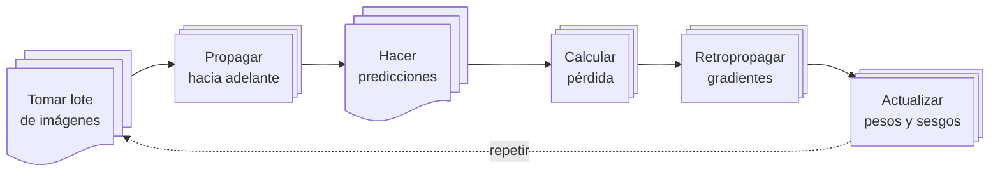

import Note from '../../components/Note.astro';
import Arquitectura from '../../components/red-neuronal/Arquitectura.astro';

La mayoría de nosotros usamos redes neuronales como quien usa una calculadora: sabemos hacerlas funcionar pero no tenemos ni idea de cómo funcionan. Si alguna vez te has parado a pensar en qué ocurre dentro —qué operaciones transforman datos en predicciones— la cosa se pone interesante.

En este artículo voy a montar una red neuronal desde cero.<Note label="Contexto">No usaremos _frameworks_, ni librerías (ni Keras, ni PyTorch, ni TensorFlow) más allá de las herramientas del propio Python y NumPy.</Note> El objetivo no es implementar algo que compita con las librerías modernas sino entender la mecánica interna de una red neuronal: cómo "aprende" ajustando sus propios sesgos y pesos.

## El problema: reconocer dígitos

Para ser fieles a los desafíos más clásicos del aprendizaje automático, vamos a usar los datos de MNIST. Son imágenes de 28 × 28 píxeles con dígitos escritos a mano, del 0 al 9.<Note label="Definición">MNIST contiene 60.000 imágenes de entrenamiento y 10.000 de test. Cada imagen es un array de 784 valores (28 × 28) que representan niveles de gris.</Note> El objetivo es simple: escribiremos una red neuronal tendrá como objetivo leer dígitos escritos a mano.

### La arquitectura

Como nuestro objetivo es pedagógico, vamos a implementar una de las arquitecturas más sencillas que, pese a su sencillez, es capaz de resolver el problema con un grado aceptable de precisión.

<Arquitectura />

- **Capa de entrada**: 784 neuronas (una por píxel de la imagen)
- **Capa oculta**: 10 neuronas con activación ReLU
- **Capa de salida**: 10 neuronas con activación softmax (una por dígito)

## Inicialización

Antes de hacer nada tenemos que asignar valores iniciales a los pesos y sesgos. Los sesgos pueden empezar a cero sin problema pero los pesos no: si todas las neuronas arrancan iguales, todas aprenden lo mismo y la red colapsa. Para evitarlo, los inicializamos con valores aleatorios pequeños.<Note label="Definición">Para los pesos de la capa oculta usamos la [inicialización de He](https://en.wikipedia.org/wiki/Weight_initialization#He_initialization), que está pensada para capas con activación ReLU.</Note>

```python
from numpy.random import randn, rand
from numpy import sqrt, zeros

# Capa oculta (con sufijo: `h` de "hidden")
W_h = randn(hidden_size, input_size) * sqrt(2.0 / input_size)
b_h = zeros((hidden_size, 1))

# Capa de salida (con sufijo `o` de "output")
W_o = rand(output_size, hidden_size) * 2 - 1
b_o = zeros((output_size, 1))

# Ratio de aprendizaje
lr = learning_rate
```

> En este artículo los fragmentos de código aparecen simplificados para facilitar su lectura. Si te animas a experimentar, el código completo con tests, evaluación y visualizaciones está en:
> - [neural-network-from-scratch](https://github.com/elcapo/neural-network-from-scratch).

Con la arquitectura de la red ya preparada, podemos empezar a implementar el paso de datos.

## Propagación hacia adelante

La propagación hacia adelante es el camino que siguen los datos desde la entrada hasta la salida. Vamos paso a paso.

### La entrada

Si tenemos un lote de `m` imágenes, la entrada es una matriz de dimensiones `(784, m)`: una columna por cada ejemplo del lote.<Note label="Aclaración">Usamos por convención las filas para representar características y las columnas para representar ejemplos.</Note>

### Capa oculta

La capa oculta transforma la entrada con sus pesos y sesgos:

$$
\mathbf{Z}_h = \mathbf{W}_h \mathbf{X} + \mathbf{b}_h
$$

```python
Z_h = W_h @ X + b_h
```

donde:

- $\mathbf{W}_h$ es la matriz de pesos de forma `(10, 784)`
- $\mathbf{b}_h$ es el vector de sesgos de forma `(10, 1)`
- $\mathbf{X}$ es la entrada de forma `(784, m)`

El resultado $\mathbf{Z}_h$ tiene forma `(10, m)`.

#### Activación ReLU

Después aplicamos la activación ReLU, que devuelve cero para valores negativos y deja pasar los positivos sin cambios:

$$
\mathbf{A}_h = \max(0, \mathbf{Z}_h)
$$

```python
from numpy import maximum

def relu(x):
    return maximum(0, x)

# dentro de forward:
A_h = relu(Z_h)
```

### Capa de salida

La capa de salida hace lo mismo pero con los valores de la capa oculta:

$$
\mathbf{Z}_o = \mathbf{W}_o \mathbf{A}_h + \mathbf{b}_o
$$

```python
Z_o = W_o @ A_h + b_o
```

donde $\mathbf{W}_o$ tiene forma `(10, 10)` y $\mathbf{b}_o$ tiene forma `(10, 1)`.

#### Activación softmax

Finalmente, la activación softmax convierte los valores en probabilidades que suman 1:

$$
\text{softmax}(\mathbf{z})_i = \frac{e^{z_i}}{\sum_j e^{z_j}}
$$

```python
from numpy import exp, max, sum

def softmax(x):
    exp_x = exp(x - max(x, axis=0, keepdims=True))
    return exp_x / sum(exp_x, axis=0, keepdims=True)

# dentro de forward:
A_o = softmax(Z_o)
```

> La salida de softmax es un vector de 10 probabilidades. La clase con mayor probabilidad es la predicción del modelo.

Aplicado al lote completo, $\mathbf{A}_o$ es una matriz `(10, m)`: una columna por ejemplo, con las 10 probabilidades en cada columna.<Note label="Aclaración">A partir de aquí pasamos de hablar de un solo ejemplo ($a_i$, $y_i$) a hablar del lote completo en mayúsculas. $\mathbf{A}_o$ son las predicciones de toda una tanda y $\mathbf{Y}$ son las etiquetas reales codificadas en one-hot, también con forma `(10, m)`.</Note>

Juntando todo, el `forward` queda así:

```python
def forward(X):
    Z_h = W_h @ X + b_h
    A_h = relu(Z_h)
    Z_o = W_o @ A_h + b_o
    A_o = softmax(Z_o)
    return A_o
```

## Retropropagación

Aquí es donde ocurre el "aprendizaje". La retropropagación calcula cómo cambiar cada peso para reducir el error. Es la aplicación de la regla de la cadena del cálculo: empezamos por el final de la red y vamos repartiendo la culpa hacia atrás, capa por capa.

### La función de pérdida

Para medir cuánto se equivoca la red usamos la entropía cruzada. Para un solo ejemplo:

$$
\mathcal{L} = -\sum_i y_i \log(a_i)
$$

donde $y_i$ es la etiqueta real (codificada en one-hot) y $a_i$ es la probabilidad predicha.

> Si el dígito verdadero es el 3, queremos que $a_3$ sea cercana a 1. El término $-\log(a_3)$ es exactamente eso:
> - cuando $a_3 \to 1$ la pérdida va a 0,
> - cuando $a_3 \to 0$ explota.

### Capa de salida

El primer gradiente que necesitamos es el de la pérdida respecto a $\mathbf{Z}_o$. Sin entrar en el desarrollo (hay un documento dedicado a la derivada de softmax), el resultado es bonito:

$$
\frac{\partial \mathcal{L}}{\partial \mathbf{Z}_o} = \mathbf{A}_o - \mathbf{Y}
$$

Es decir: la diferencia entre lo que predijo la red y lo que debería haber predicho. Si para el dígito 5 la red dio probabilidad 0.8 pero la etiqueta real era 1, el gradiente es `0.8 - 1 = -0.2` para esa clase.

```python
dZ_o = A_o - Y
```

A partir de ese gradiente, sacamos el de los pesos $\mathbf{W}_o$:

$$
\frac{\partial \mathcal{L}}{\partial \mathbf{W}_o} = \frac{\partial \mathcal{L}}{\partial \mathbf{Z}_o} \mathbf{A}_h^T
$$

```python
dW_o = dZ_o @ A_h.T / m
```

> El `/ m` es lo que promedia el gradiente sobre los `m` ejemplos del lote, para que el tamaño del paso no dependa del tamaño del lote.

Y el del sesgo $\mathbf{b}_o$:

$$
\frac{\partial \mathcal{L}}{\partial \mathbf{b}_o} = \frac{\partial \mathcal{L}}{\partial \mathbf{Z}_o} \cdot \mathbf{1}
$$

donde $\mathbf{1}$ es un vector de unos: el producto equivale a sumar sobre las columnas del lote.

```python
db_o = sum(dZ_o, axis=1, keepdims=True) / m
```

### Capa oculta

Para llegar a la capa oculta, primero calculamos cuánto contribuyó cada activación $\mathbf{A}_h$ al error:

$$
\frac{\partial \mathcal{L}}{\partial \mathbf{A}_h} = \mathbf{W}_o^T \frac{\partial \mathcal{L}}{\partial \mathbf{Z}_o}
$$

```python
dA_h = W_o.T @ dZ_o
```

Después aplicamos el gradiente de ReLU, que es 1 donde la entrada era positiva y 0 donde era negativa:

$$
\frac{\partial \mathcal{L}}{\partial \mathbf{Z}_h} = \frac{\partial \mathcal{L}}{\partial \mathbf{A}_h} \odot \mathbf{1}_{\mathbf{Z}_h > 0}
$$

```python
def relu_derivative(x):
    return (x > 0).astype(float)

# dentro de backward:
dZ_h = dA_h * relu_derivative(Z_h)
```

Aquí hay un detalle clave: **si una neurona estaba apagada durante la propagación hacia adelante (su valor era ≤ 0), su gradiente es 0**. No aprende nada en este paso. Cuando una neurona se queda en ese estado para todos los ejemplos, hablamos de una "neurona muerta": no contribuye a la salida y tampoco recibe señal para corregirse.

Y por último, los gradientes de los parámetros de la capa oculta:

$$
\frac{\partial \mathcal{L}}{\partial \mathbf{W}_h} = \frac{\partial \mathcal{L}}{\partial \mathbf{Z}_h} \mathbf{X}^T
$$

```python
dW_h = dZ_h @ X.T / m
db_h = sum(dZ_h, axis=1, keepdims=True) / m
```

Juntando los dos pasos en un solo método:

```python
def backward(X, Y):
    m = X.shape[1]
    dZ_o = A_o - Y
    dW_o = dZ_o @ A_h.T / m
    db_o = sum(dZ_o, axis=1, keepdims=True) / m

    dA_h = W_o.T @ dZ_o
    dZ_h = dA_h * relu_derivative(Z_h)
    dW_h = dZ_h @ X.T / m
    db_h = sum(dZ_h, axis=1, keepdims=True) / m
```

## Descenso de gradiente

Con todos los gradientes calculados, solo falta actualizar los parámetros en la dirección contraria al gradiente:

$$
\mathbf{W} \leftarrow \mathbf{W} - \eta \cdot \frac{\partial \mathcal{L}}{\partial \mathbf{W}}
$$

donde $\eta$ es la tasa de aprendizaje, un hiperparámetro que controla cuánto nos movemos en cada paso.

> Restamos el gradiente (multiplicado por la tasa de aprendizaje). Si el gradiente es positivo, el peso disminuye; si es negativo, aumenta. Siempre vamos "cuesta abajo".

En código, las actualizaciones tienen este aspecto:

```python
def update():
    W_o -= lr * dW_o
    b_o -= lr * db_o
    W_h -= lr * dW_h
    b_h -= lr * db_h
```

## Por qué funciona

Las matemáticas que están detrás de todo esto tienen una elegancia digna de mención:

1. **Softmax + entropía cruzada** dan un gradiente limpio: $\mathbf{A}_o - \mathbf{Y}$. Sin complicaciones, sin términos extra.

2. **ReLU** es computacionalmente eficiente y no aplasta los gradientes como hacen otras activaciones (sigmoide, tanh), aunque trae consigo el problema de las neuronas muertas que vimos al retropropagar.

3. **La regla de la cadena** permite propagar el error hacia atrás capa por capa, calculando todos los gradientes con solo dos pasadas por la red.



La clave del aprendizaje es que cada peso recibe un gradiente que le dice exactamente cuánto contribuyó al error final, y en qué dirección debería ajustarse.

## Siguientes pasos

Lo que hemos visto es la versión más simple. Hay muchas cosas que se pueden mejorar:

- **Más capas**: hoy en día las redes tienen decenas o cientos de capas ocultas.
- **Optimizadores**: Adam, SGD con momentum... el descenso de gradiente vanilla es solo el comienzo.
- **Normalización**: batch normalization, dropout...
- **Convoluciones**: para imágenes, las capas convolucionales funcionan mejor que las densas.

Pero la base es esta. Si entiendes esto, entiendes el núcleo de lo que hacen PyTorch y TensorFlow bajo el capó.