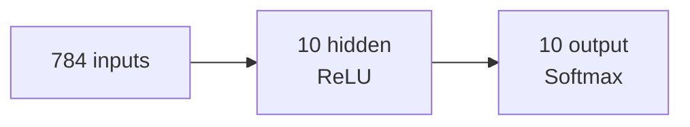

import Note from '../../components/Note.astro';

La mayoría de nosotros usamos redes neuronales como quien usa una calculadora: funcionar, funciona, pero no preguntes cómo. Si alguna vez te has parado a pensar en qué ocurre dentro —qué operaciones transforman tus datos en una predicción— las cosas se ponen interesantes.

En este artículo voy a desmontar una red neuronal desde cero. Sin Keras, sin PyTorch, sin TensorFlow. Solo Python, NumPy y la matemática que lo hace posible. El objetivo no es implementar algo que compita con las librerías modernas, sino entender la mecánica interna: cómo una red "aprende" ajustando pesos y sesgos.

## El problema: reconocer dígitos

Para tener algo concreto que resolver, usaremos el ejemplo clásico: el dataset MNIST. Son imágenes de 28 × 28 píxeles con dígitos escritos a mano, del 0 al 9.<Note label="Dataset">MNIST contiene 60.000 imágenes de entrenamiento y 10.000 de test. Cada imagen es un array de 784 valores (28 × 28) que representan niveles de gris.</Note>

El objetivo es simple: dada una imagen, decir qué dígito es.

### La arquitectura

Diseñemos la red más sencilla que funcione:

- **Capa de entrada**: 784 neuronas (una por píxel de la imagen)
- **Capa oculta**: 10 neuronas con activación ReLU
- **Capa de salida**: 10 neuronas con activación softmax (una por dígito)



Cada capa tiene dos operaciones: primero una transformación lineal (pesos × entradas + sesgo), luego una activación no lineal.

## Inicialización

Antes de hacer nada, hay que poner valores iniciales a los pesos y sesgos. Los sesgos pueden empezar a cero sin problema, pero los pesos no: si todas las neuronas arrancan iguales, todas aprenden lo mismo y la red colapsa. Por eso los inicializamos con valores aleatorios pequeños.<Note label="Inicialización de He">La fórmula `randn * sqrt(2 / n)` se conoce como inicialización de He y está pensada para capas que usarán ReLU. La idea: escalar la varianza de los pesos según el número de entradas para que la señal no se dispare ni se desvanezca a medida que avanza por la red.</Note>

```python
import numpy as np

class NeuralNetwork:
    def __init__(self, input_size, hidden_size, output_size, learning_rate=0.01):
        self.lr = learning_rate
        self.W_h = np.random.randn(hidden_size, input_size) * np.sqrt(2.0 / input_size)
        self.b_h = np.zeros((hidden_size, 1))
        self.W_o = np.random.randn(output_size, hidden_size) * np.sqrt(2.0 / hidden_size)
        self.b_o = np.zeros((output_size, 1))
```

Con la red preparada, ya podemos hacer pasar datos por ella.

## Propagación hacia adelante

La propagación hacia adelante es el camino que siguen los datos desde la entrada hasta la salida. Vamos paso a paso.

### La entrada

Si tenemos un lote de `m` imágenes, la entrada es una matriz de dimensiones `(784, m)`: una columna por cada ejemplo del lote.<Note label="Convenciones">Usamos la convención de filas = características y columnas = ejemplos. Es la que mejor funciona con NumPy para hacer multiplicaciones de matrices.</Note>

### Capa oculta

La capa oculta transforma la entrada con sus pesos y sesgos:

$$
\mathbf{Z}_h = \mathbf{W}_h \mathbf{X} + \mathbf{b}_h
$$

donde:

- $\mathbf{W}_h$ es la matriz de pesos de forma `(10, 784)`
- $\mathbf{b}_h$ es el vector de sesgos de forma `(10, 1)`
- $\mathbf{X}$ es la entrada de forma `(784, m)`

El resultado $\mathbf{Z}_h$ tiene forma `(10, m)`. En código, una sola línea:

```python
self.Z_h = self.W_h @ X + self.b_h
```

Después aplicamos la activación ReLU, que devuelve cero para valores negativos y deja pasar los positivos sin cambios:

$$
\mathbf{A}_h = \max(0, \mathbf{Z}_h)
$$

```python
def relu(self, x):
    return np.maximum(0, x)

# dentro de forward:
self.A_h = self.relu(self.Z_h)
```

### Capa de salida

La capa de salida hace lo mismo pero con los valores de la capa oculta:

$$
\mathbf{Z}_o = \mathbf{W}_o \mathbf{A}_h + \mathbf{b}_o
$$

donde $\mathbf{W}_o$ tiene forma `(10, 10)` y $\mathbf{b}_o$ tiene forma `(10, 1)`.

```python
self.Z_o = self.W_o @ self.A_h + self.b_o
```

Finalmente, la activación softmax convierte los valores en probabilidades que suman 1:

$$
\text{softmax}(\mathbf{z})_i = \frac{e^{z_i}}{\sum_j e^{z_j}}
$$

```python
def softmax(self, x):
    exp_x = np.exp(x - np.max(x, axis=0, keepdims=True))
    return exp_x / np.sum(exp_x, axis=0, keepdims=True)

# dentro de forward:
self.A_o = self.softmax(self.Z_o)
```

> La salida de softmax es un vector de 10 probabilidades. La clase con mayor probabilidad es la predicción del modelo.

Aplicado al lote completo, $\mathbf{A}_o$ es una matriz `(10, m)`: una columna por ejemplo, con las 10 probabilidades en cada columna.<Note label="Del ejemplo al lote">A partir de aquí pasamos de hablar de un solo ejemplo ($a_i$, $y_i$) a hablar del lote completo en mayúsculas. $\mathbf{A}_o$ son las predicciones de toda una tanda y $\mathbf{Y}$ son las etiquetas reales codificadas en one-hot, también con forma `(10, m)`.</Note>

Juntando todo, el `forward` queda así:

```python
def forward(self, X):
    self.Z_h = self.W_h @ X + self.b_h
    self.A_h = self.relu(self.Z_h)
    self.Z_o = self.W_o @ self.A_h + self.b_o
    self.A_o = self.softmax(self.Z_o)
    return self.A_o
```

## Retropropagación

Aquí es donde ocurre el "aprendizaje". La retropropagación calcula cómo cambiar cada peso para reducir el error. Es la aplicación de la regla de la cadena del cálculo: empezamos por el final de la red y vamos repartiendo la culpa hacia atrás, capa por capa.

### La función de pérdida

Para medir cuánto se equivoca la red usamos la entropía cruzada. Para un solo ejemplo:

$$
\mathcal{L} = -\sum_i y_i \log(a_i)
$$

donde $y_i$ es la etiqueta real (codificada en one-hot) y $a_i$ es la probabilidad predicha.

La intuición es clara: si el dígito verdadero es el 3, queremos que $a_3$ sea cercana a 1. El término $-\log(a_3)$ es exactamente eso: cuando $a_3 \to 1$ la pérdida va a 0; cuando $a_3 \to 0$ explota.

### Capa de salida

El primer gradiente que necesitamos es el de la pérdida respecto a $\mathbf{Z}_o$. Sin entrar en el desarrollo (hay un documento dedicado a la derivada de softmax), el resultado es bonito:

$$
\frac{\partial \mathcal{L}}{\partial \mathbf{Z}_o} = \mathbf{A}_o - \mathbf{Y}
$$

Es decir: la diferencia entre lo que predijo la red y lo que debería haber predicho. Si para el dígito 5 la red dio probabilidad 0.8 pero la etiqueta real era 1, el gradiente es `0.8 - 1 = -0.2` para esa clase.

```python
dZ_o = self.A_o - Y
```

A partir de ese gradiente, sacamos el de los pesos $\mathbf{W}_o$:

$$
\frac{\partial \mathcal{L}}{\partial \mathbf{W}_o} = \frac{\partial \mathcal{L}}{\partial \mathbf{Z}_o} \mathbf{A}_h^T
$$

```python
self.dW_o = dZ_o @ self.A_h.T / m
```

El `/ m` es lo que promedia el gradiente sobre los `m` ejemplos del lote, para que el tamaño del paso no dependa del tamaño del lote.

Y el del sesgo $\mathbf{b}_o$:

$$
\frac{\partial \mathcal{L}}{\partial \mathbf{b}_o} = \frac{\partial \mathcal{L}}{\partial \mathbf{Z}_o} \cdot \mathbf{1}
$$

donde $\mathbf{1}$ es un vector de unos: el producto equivale a sumar sobre las columnas del lote.

```python
self.db_o = np.sum(dZ_o, axis=1, keepdims=True) / m
```

### Capa oculta

Para llegar a la capa oculta, primero calculamos cuánto contribuyó cada activación $\mathbf{A}_h$ al error:

$$
\frac{\partial \mathcal{L}}{\partial \mathbf{A}_h} = \mathbf{W}_o^T \frac{\partial \mathcal{L}}{\partial \mathbf{Z}_o}
$$

```python
dA_h = self.W_o.T @ dZ_o
```

Después aplicamos el gradiente de ReLU, que es 1 donde la entrada era positiva y 0 donde era negativa:

$$
\frac{\partial \mathcal{L}}{\partial \mathbf{Z}_h} = \frac{\partial \mathcal{L}}{\partial \mathbf{A}_h} \odot \mathbf{1}_{\mathbf{Z}_h > 0}
$$

```python
def relu_derivative(self, x):
    return (x > 0).astype(float)

# dentro de backward:
dZ_h = dA_h * self.relu_derivative(self.Z_h)
```

Aquí hay un detalle clave: **si una neurona estaba apagada durante la propagación hacia adelante (su valor era ≤ 0), su gradiente es 0**. No aprende nada en este paso. Cuando una neurona se queda en ese estado para todos los ejemplos, hablamos de una "neurona muerta": no contribuye a la salida y tampoco recibe señal para corregirse.

Y por último, los gradientes de los parámetros de la capa oculta:

$$
\frac{\partial \mathcal{L}}{\partial \mathbf{W}_h} = \frac{\partial \mathcal{L}}{\partial \mathbf{Z}_h} \mathbf{X}^T
$$

```python
self.dW_h = dZ_h @ X.T / m
self.db_h = np.sum(dZ_h, axis=1, keepdims=True) / m
```

Juntando los dos pasos en un solo método:

```python
def backward(self, X, Y):
    m = X.shape[1]
    dZ_o = self.A_o - Y
    self.dW_o = dZ_o @ self.A_h.T / m
    self.db_o = np.sum(dZ_o, axis=1, keepdims=True) / m

    dA_h = self.W_o.T @ dZ_o
    dZ_h = dA_h * self.relu_derivative(self.Z_h)
    self.dW_h = dZ_h @ X.T / m
    self.db_h = np.sum(dZ_h, axis=1, keepdims=True) / m
```

## Descenso de gradiente

Con todos los gradientes calculados, solo falta actualizar los parámetros en la dirección contraria al gradiente:

$$
\mathbf{W} \leftarrow \mathbf{W} - \eta \cdot \frac{\partial \mathcal{L}}{\partial \mathbf{W}}
$$

donde $\eta$ es la tasa de aprendizaje, un hiperparámetro que controla cuánto nos movemos en cada paso.

> Si el gradiente es positivo, restamos; si es negativo, sumamos. Siempre vamos "cuesta abajo".

En código, una línea por parámetro:

```python
def update(self):
    self.W_o -= self.lr * self.dW_o
    self.b_o -= self.lr * self.db_o
    self.W_h -= self.lr * self.dW_h
    self.b_h -= self.lr * self.db_h
```

Un ciclo completo de entrenamiento:

1. Tomar un lote de imágenes
2. Propagar hacia adelante → obtener predicciones
3. Calcular la pérdida
4. Retropropagar → obtener todos los gradientes
5. Actualizar pesos y sesgos
6. Repetir

En las pruebas que hice con MNIST, esta red alcanza alrededor del 90% de precisión en el conjunto de test. No está mal para algo que cabe en una clase de Python.

## Por qué funciona

La matemática detrás de todo esto tiene una elegancia que merece apreciarse:

1. **Softmax + entropía cruzada** dan un gradiente limpio: $\mathbf{A}_o - \mathbf{Y}$. Sin complicaciones, sin términos extra.

2. **ReLU** es computacionalmente eficiente y no aplasta los gradientes como hacen otras activaciones (sigmoide, tanh), aunque trae consigo el problema de las neuronas muertas que vimos al retropropagar.

3. **La regla de la cadena** permite propagar el error hacia atrás capa por capa, calculando todos los gradientes con solo dos pasadas por la red.

La clave del aprendizaje es que cada peso recibe un gradiente que le dice exactamente cuánto contribuyó al error final, y en qué dirección debería ajustarse.

## Siguientes pasos

Lo que hemos visto es la versión más simple. Hay muchas cosas que se pueden mejorar:

- **Más capas**: hoy en día las redes tienen decenas o cientos de capas ocultas.
- **Optimizadores**: Adam, SGD con momentum... el descenso de gradiente vanilla es solo el comienzo.
- **Normalización**: batch normalization, dropout...
- **Convoluciones**: para imágenes, las capas convolucionales funcionan mejor que las densas.

Pero la base es esta. Si entiendes esto, entiendes el núcleo de lo que hacen PyTorch y TensorFlow bajo el capó.

> PD: Si te animas a experimentar, el código completo con tests, evaluación y visualizaciones está en [neural-network-from-scratch](https://github.com/elcapo/neural-network-from-scratch). Y si quieres ver la matemática en detalle, hay un documento dedicado a las derivadas de softmax.
